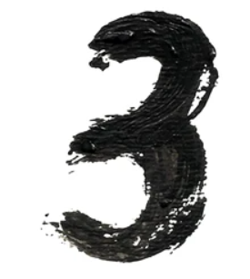

# 🖋️ **Handwritten Digit Classifier**  
This project is a **Machine Learning model** developed in Python using **TensorFlow/Keras**, **Matplotlib**, and **NumPy**.  

The model can **classify handwritten digits (0–9)** from grayscale images and predict results with an impressive **accuracy of 96.83%**. It also supports visualization of training metrics and predictions for easy analysis.  

---

## 📸 **Demo Preview**  

Test the classifier with preloaded sample images in the repository:  

```python
from predict import predict_digit

# Predict sample digits
predict_digit('samples/digit1.png')  # Predicts first sample
predict_digit('samples/digit2.png')  # Predicts second sample
predict_digit('samples/digit3.png')  # Predicts third sample
```

| Input Image                                      | Prediction |
|--------------------------------------------------|------------|
|        | **3** ✔️   |
|        | **8** ✔️   |
|        | **0** ✔️   |

---

## 🛠️ **Key Features**  

- **Digit Classification** – Recognizes digits (0–9) from images.  
- **High Accuracy** – Achieves **96.83% accuracy** during testing.  
- **Visualization Tools** – Uses **Matplotlib** to display results and learning curves.  
- **Easy-to-Use API** – Flexible input format for predictions.  
- **Preloaded Samples** – Includes sample test images for quick evaluation.  

---

## 📦 **Tech Stack**  

- **Language:** Python 🐍  
- **Libraries:**  
  - TensorFlow/Keras 🤖  
  - NumPy 📏  
  - Matplotlib 📊  
  - Scikit-learn 🧪  

---

## 🧑‍💻 **Installation Guide**  

### 1. **Clone this Repository**  

```bash
git clone https://github.com/yourusername/digit-classifier.git
cd digit-classifier
```

### 2. **Install Dependencies**  

```bash
pip install -r requirements.txt
```

### 3. **Run the Model**  

```bash
python main.py
```
---

## 📊 **Model Performance**

| Metric       | Value     |
|--------------|-----------|
| Accuracy     | **96.83%** |
| Loss         | 0.072      |
| Validation   | **97.12%** |

---

## 🎯 **To-Do List**

- Optimize hyperparameters for better performance.
- Add support for colored image classification.
- Deploy the model as a web application.

---

## 💬 **Feedback & Contributions**

Contributions are always welcome!

- Feel free to **fork this repo**, submit **pull requests**, or open **issues**.
- Your suggestions and improvements are highly appreciated! 🙌

---

### **If you find this project helpful, consider giving it a star!** ⭐
